# NBE4-5-1-Team09
프로그래머스 백엔드 데브코스 4기 5회차 9팀 예외처리반 1차 프로젝트 - 카페 메뉴 관리 서비스 제작

# 프로젝트 기간
2025/02/19 12:00 ~ 2025/02/27 12:00

# 구성원
[장무영](https://github.com/wkdan), [신동훈](https://github.com/SDHSeoulTech), [신윤호](https://github.com/messiteacher), [최재우](https://github.com/cjw0324)

# 프로젝트 필수 요구 사항
### HTTP 메서드 POST를 이용해 Create, GET을 이용해 Read, PUT을 이용해 Update, DELETE를 이용해 Delete 기능을 구현해주세요.

- PUT : 해당하는 id에 해당하는 데이터를 갱신하는 기능을 구현합니다.
- DELETE : 해당하는 id에 해당하는 데이터를 삭제하는 기능을 구현합니다.
- POST: 요청이 들어올 때마다 id가 하나씩 증가하여 menu 리스트에 추가될 수 있도록 코드를 추가 구현합니다.
- SQL과 ORM 중 하나를 선택하여 데이터 베이스를 구현하여 제작합니다.
- 구현한 데이터베이스 연동을 구현합니다.

# DB ERD (ver.0.1)
https://www.erdcloud.com/team/kKm3uNXtgGF56Jrxx

# 시스템 흐름도 초안

