# NBE4-5-1-Team09
프로그래머스 백엔드 데브코스 4기 5회차 9팀 예외처리반 1차 프로젝트 - 카페 메뉴 관리 서비스 제작

# 프로젝트 기간
2025/02/19 12:00 ~ 2025/02/27 12:00

# 구성원
[장무영](https://github.com/wkdan), [신동훈](https://github.com/SDHSeoulTech), [신윤호](https://github.com/messiteacher), [최재우](https://github.com/cjw0324)

# 프로젝트 필수 요구 사항
### HTTP 메서드 POST를 이용해 Create, GET을 이용해 Read, PUT을 이용해 Update, DELETE를 이용해 Delete 기능을 구현해주세요.

- PUT : 해당하는 id에 해당하는 데이터를 갱신하는 기능을 구현합니다.
- DELETE : 해당하는 id에 해당하는 데이터를 삭제하는 기능을 구현합니다.
- POST: 요청이 들어올 때마다 id가 하나씩 증가하여 menu 리스트에 추가될 수 있도록 코드를 추가 구현합니다.
- SQL과 ORM 중 하나를 선택하여 데이터 베이스를 구현하여 제작합니다.
- 구현한 데이터베이스 연동을 구현합니다.

# 주요 기능(임시)
일반 회원(이메일 인증, 시큐리티, 토큰)

- 가입, 로그인, 로그아웃
- 주문 상태 조회

관리자

- 상품 등록, 수정, 삭제
- 상품 목록 및 상세 정보 조회
- 재고 관리 (입출고)

- 전체 주문 내역 조회
- 주문 상태 변경
- 고객 주문 내역 상세 조회

상품 조회, 주문

- 상품 목록 및 상세 정보 조회
    - 페이징 적용
    - 인기순, 리뷰순, 평점 순, 카테고리 등등..
- 장바구니/ 주문
    - 장바구니에 상품 담는 순간 주문 상태 변경
    - 주문 확정 시 주문 상태 변경
- 수량 선택, 가격 확인, 결제

배송 조회

- 주문별 배송 상태 조회

리뷰 및 평점 시스템

- 실제 주문한 상품 리뷰 및 평점 (1개씩)
- 작성한 리뷰 수정/삭제

배송 및 통계

- 주문 별 배송 상태 업데이트
- 매출, 주문 건수, 통계 제공

# 시스템 명세서

### 주문 및 주문 상품

**담당자**: 최재우

#### 주문 프로세스

1. **상품 주문 요청 (상품 상세 페이지)**
   - **액터**: 사용자  
   - **처리**: 상품 상세 페이지에서 수량 선택 후 주문 요청  
   - **동작**: 주문 테이블에 상품 등록 (한 주문에 여러 상품 등록 가능)  
   - **초기 상태**: `WANT`

2. **장바구니 관리**
   - **액터**: 사용자  
   - **기능**: 장바구니에서 주문 요청한 상품 목록 및 총 금액 확인  
     - 수량 수정, 특정 상품 삭제 가능

3. **최종 주문 요청**
   - **액터**: 사용자  
   - **동작**: 장바구니에서 최종 주문 요청 시 상태 변경 `WANT` → `BUY`

4. **결제 진행**
   - **액터**: 사용자  
   - **동작**: 특정 URL 호출 시 결제 진행 (추후 테스트 결제 도입 예정)  
   - **상태 변경**:  
     - 결제 성공: `BUY` → `PAY`  
     - 결제 실패: `BUY` → `REFUSED`

5. **관리자 승인**
   - **액터**: 관리자  
   - **동작**: 관리자 페이지에서 주문 승인 또는 거절  
   - **상태 변경**:
     - 오전 2시 이전 승인: `BUY` → `BEFORE_DELIVERY`  
     - 오후 2시 이후 승인: `BUY` → `PREPARE_DELIVERY`  
     - 승인 거절: `BUY` → `REFUSED`

6. **배송 준비 및 진행**
   - **액터**: 관리자  
   - **동작**:  
     - 승인 후 배송 준비 처리  
       - 2시 이전: `BEFORE_DELIVERY` (배송 대기)  
       - 2시 이후: `PREPARE_DELIVERY` (배송 준비)
     - 배송 준비 상태에서 배송 중으로 상태 변경:  
       - `BEFORE_DELIVERY` → `IN_DELIVERY` (배송 중)
     - 배송 중인 상태에서 배송 완료 처리:  
       - `IN_DELIVERY` → `POST_DELIVERY` (배송 완료)

#### 주문 상태 종류

- `WANT`: 장바구니에 담긴 상태
- `BUY`: 구매 요청 후 결제 전 상태
- `PAY`: 결제 완료 상태
- `BEFORE_DELIVERY`: 배송 대기 상태
- `PREPARE_DELIVERY`: 배송 준비 상태
- `IN_DELIVERY`: 배송 중 상태
- `POST_DELIVERY`: 배송 완료 상태
- `REFUSED`: 주문 취소 (어떤 상태에서든 취소 시 해당 상태 적용)

---

### 상품 관리

**담당자**: 신윤호

#### 1. 상품 목록 조회

- **액터**: 사용자  
- **흐름**:
  1. 상품 목록 페이지에 접근  
  2. 서버에서 상품 정보 제공  
  3. 제공된 정보를 바탕으로 상품 목록 확인

#### 2. 상품 상세 정보 조회

- **액터**: 사용자  
- **흐름**:
  1. 특정 상품 클릭  
  2. 서버에서 해당 상품 정보 및 구매 가능 여부 제공
- **예외**:
  - 존재하지 않는 상품인 경우: 오류 메시지와 함께 상품 목록 페이지로 리디렉션

#### 3. 상품 등록

- **액터**: 관리자  
- **흐름**:
  1. 상품 등록 페이지에 접근  
  2. 상품 정보 입력 후 등록 버튼 클릭  
  3. 서버가 데이터베이스에 저장 후 등록 완료 메시지 전달
- **예외**:
  - 필수 값 누락 시: 오류 메시지 표시 및 등록 실패

#### 4. 상품 수정

- **액터**: 관리자  
- **흐름**:
  1. 수정할 상품 선택  
  2. 상품 정보 수정 후 수정 버튼 클릭  
  3. 서버가 수정된 정보 업데이트 후 확인 메시지 전달
- **예외**:
  - 필수 값 누락 시: 오류 메시지 표시 및 수정 실패

#### 5. 상품 삭제

- **액터**: 관리자  
- **흐름**:
  1. 삭제할 상품 선택  
  2. 삭제 버튼 클릭  
  3. 서버가 데이터베이스에서 해당 상품 삭제 후 삭제 확인

---

### 후기 관리

**담당자**: 신동훈

#### 1. 리뷰 작성

- **액터**: 고객 (로그인 상태, 구매 이력 필수)  
- **기능**:
  - 상품 상세 페이지에서 리뷰 작성 (내용, 평점 포함)  
  - 작성 시간이 자동 기록됨
- **흐름**:
  1. 리뷰 작성 버튼 클릭  
  2. 리뷰 내용 및 평점 입력  
  3. 작성 버튼 클릭 → 리뷰 데이터베이스에 저장

#### 2. 리뷰 수정

- **액터**: 고객 (기존에 작성한 리뷰 보유)  
- **특징**: 내 리뷰는 다른 리뷰와 별도로 상단에 노출됨  
- **흐름**:
  1. 작성한 리뷰에서 수정 버튼 클릭  
  2. 내용 및 평점 수정 후 저장 버튼 클릭  
  3. 수정 시간이 자동 기록되어 데이터베이스 업데이트

#### 3. 리뷰 삭제

- **액터**: 고객 (기존에 작성한 리뷰 보유)  
- **흐름**:
  1. 작성한 리뷰에서 삭제 버튼 클릭  
  2. 확인 메시지 후 삭제 확정  
  3. 서버가 데이터베이스에서 해당 리뷰 삭제

#### 4. 상품별 리뷰 조회

- **액터**: 고객, 관리자  
- **기능**:
  - 고객: 상품 상세 페이지에서 다른 고객들의 리뷰 확인  
  - 관리자: 상품 관리 페이지에서 모든 상품의 리뷰 조회  
  - 리뷰 목록은 최신순, 평점(낮은/높은 순) 등으로 정렬 가능
- **흐름**:
  1. 페이지 접속 후 리뷰 목록 확인  
  2. 정렬 기준 변경 가능

#### 5. 평균 평점 조회

- **액터**: 고객, 관리자  
- **기능**:
  - 고객: 상품 및 상품 상세 페이지에서 평균 평점 확인  
  - 관리자: 상품 관리 페이지에서 각 상품의 평균 평점 확인
- **흐름**:
  1. 해당 페이지에서 평균 평점 표시

#### 6. 예외 처리

- **필수 항목 누락**:  
  - 리뷰 작성 시 내용 또는 평점 누락 시 “리뷰 내용과 평점은 필수 항목입니다.” 메시지 표시  
  - 고객은 필수 항목을 재입력해야 함
- **리뷰 미존재**:  
  - 상품에 리뷰가 없는 경우 “아직 리뷰가 없습니다.” 메시지 표시
- **데이터베이스 오류**:  
  - 평균 평점 조회 중 오류 발생 시 자동 재실행 처리

---

### 유저 관리

**담당자**: 장무영

#### 1. 회원 가입

##### 1.1. 일반 회원 가입

- **액터**: 사용자  
- **흐름**:
  1. 회원 가입 폼에 이메일, 비밀번호, 주소 등 입력 후 가입 클릭  
  2. 서비스에서 이메일 중복 확인 및 비밀번호 암호화 후 USER 엔티티 생성  
  3. 레포지토리가 회원 정보를 데이터베이스에 저장  
  4. 컨트롤러가 성공 응답 반환

##### 1.2. 관리자 회원 가입

- **액터**: 관리자 권한을 가진 사용자  
- **흐름**:
  1. 회원 가입 폼에 이메일, 비밀번호, 주소, 관리자 코드 입력 후 가입 클릭  
  2. 서비스에서 이메일 중복 확인, 비밀번호 암호화 및 관리자 코드 검증  
  3. 코드 일치 시 권한을 `ADMIN`으로 설정 (불일치 시 가입 거부 또는 일반 사용자 처리)  
  4. 컨트롤러가 결과 응답 반환

#### 2. 로그인

##### 2.1. 일반 회원 로그인

- **액터**: 사용자  
- **흐름**:
  1. 로그인 폼에 이메일, 비밀번호 입력 후 로그인 버튼 클릭  
  2. 컨트롤러가 요청 데이터 검증 후 서비스 전달  
  3. 서비스에서 이메일로 사용자 조회, 암호화된 비밀번호 비교 후 JWT 토큰 생성  
  4. 컨트롤러가 JWT 토큰과 함께 성공 응답 반환

##### 2.2. 관리자 로그인

- **액터**: 관리자  
- **흐름**:
  1. 별도의 관리자 로그인 엔드포인트를 통해 로그인  
  2. 로그인 폼에 이메일, 비밀번호 입력 후 로그인 버튼 클릭  
  3. 컨트롤러가 요청 데이터 검증 후 관리자 로그인 메서드 호출  
  4. 서비스에서 일반 로그인 절차와 함께 사용자의 권한(`ADMIN`) 검증  
  5. JWT 토큰 생성 후 응답 반환

#### 3. 비밀번호 재설정

- **액터**: 사용자, 관리자  
- **흐름**:
  1. 비밀번호 재설정 요청 시 이메일 입력  
  2. 컨트롤러가 이메일 정보를 서비스에 전달  
  3. 서비스에서 계정 존재 여부 확인 후 재설정 링크 발송  
  4. 액터가 링크 클릭 또는 코드 입력 후 새 비밀번호 입력  
  5. 컨트롤러가 새 비밀번호를 수신 후 서비스 전달  
  6. 서비스에서 새 비밀번호 암호화 및 DB 업데이트  
  7. 컨트롤러가 성공 응답 반환

#### 4. 회원 탈퇴

- **액터**: 사용자, 관리자  
- **흐름**:
  1. “회원 탈퇴” 버튼 클릭 후 추가 확인(비밀번호 재입력)  
  2. 컨트롤러가 탈퇴 요청 및 인증 정보를 서비스에 전달  
  3. 서비스에서 본인 확인 후 탈퇴 처리  
  4. 레포지토리가 회원 데이터를 정리  
  5. 컨트롤러가 성공 응답 반환

#### 5. 로그아웃

- **액터**: 사용자, 관리자  
- **흐름**:
  1. 로그아웃 요청 발생  
  2. 컨트롤러가 요청을 수신 후 서비스에 전달  
  3. 서비스에서 JWT 무효화 또는 세션 종료 작업 수행  
  4. 컨트롤러가 로그아웃 성공 응답 반환

#### 6. 이메일 인증

- **액터**: 사용자, 관리자  
- **흐름**:
  1. 회원 가입 시 이메일 입력 후 가입 요청  
  2. 시스템이 인증 링크 또는 코드를 포함한 이메일 발송  
  3. 액터가 이메일 링크 클릭 또는 코드 입력하여 인증 요청  
  4. 컨트롤러가 인증 요청 수신 후 서비스 전달  
  5. 서비스에서 토큰 유효성 검증 후 회원 계정 활성화  
  6. 컨트롤러가 성공 응답 반환

# DB ERD (ver.0.1)
https://www.erdcloud.com/team/kKm3uNXtgGF56Jrxx

# 시스템 흐름도 초안

